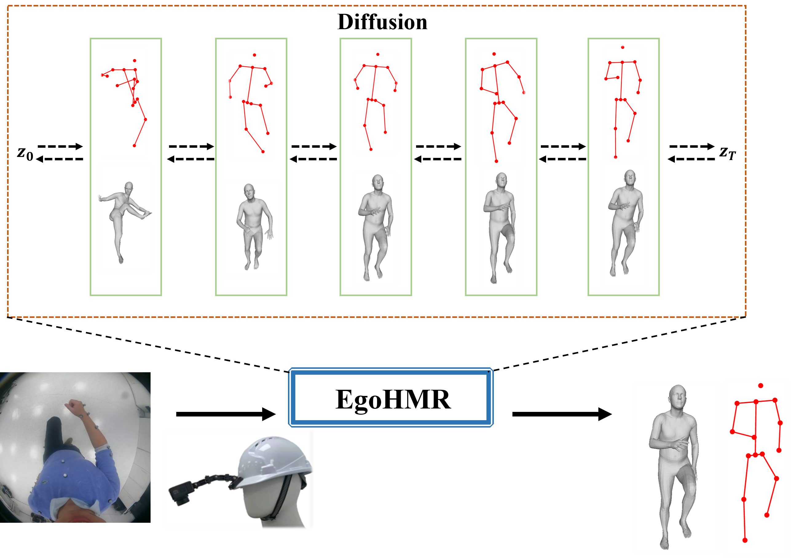
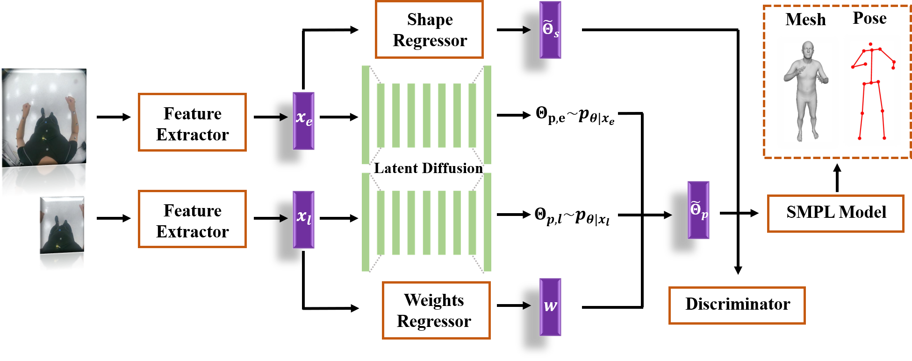

# EgoHMR
[**ICRA 2023**] Repo for our paper "**EgoHMR: Egocentric Human Mesh Recovery via Hierarchical Latent Diffusion Model**" [[paper--coming soon]()]

<p align="center"></p>

## Abstract
We propose Egocentric Human Mesh Recovery (EgoHMR), a novel hierarchical network based on latent diffusion models. Our method takes a single egocentric frame as the input and it can be trained in an end-to-end manner without supervision of 2D pose. The network is built upon the latent diffusion model by incorporating both global and  local features in a hierarchical structure. To train the proposed network, we generate weak labels from synchronized exocentric images. The proposed method can perform human mesh recovery directly from egocentric images and detailed quantitative and qualitative experiments have been conducted to demonstrate the effectiveness of the proposed EgoHMR method.

## Contributions
1) We propose an end-to-end hierarchical diffusion probabilistic model for human mesh recovery from an egocentric image captured by a camera looking downwards.
2) Our method skips the inaccurate and tedious process for egocentric 2D pose estimation, and achieves the comparable results with state-of-the-art methods which require 2D cues as supervision.
3) Quantitative and qualitative results on different datasets demonstrate the effectiveness of our proposed hierarchical network for both human mesh recovery and human pose estimation.

<p align="center"></p>

## Brief Introduction


https://user-images.githubusercontent.com/86871168/228405643-47a6620b-79ae-4cae-86bd-01e5406a4c1f.mp4

## Dataset
- [x] <b>ECHP Dataset</b> [[link](https://github.com/Lrnyux/EgoCentric-Human-Pose-ECHP-Dataset)]
- [x] <b>EgoPW Dataset</b> [[link]([https://github.com/Lrnyux/EgoCentric-Human-Pose-ECHP-Dataset](https://people.mpi-inf.mpg.de/~jianwang/projects/egopw/))]

## Code
Related codes will be available in the future.

## Citation
If you find our paper/dataset/code useful, please consider citing:
```bibtex
@INPROCEEDINGS{liu2023Egohmr,
  author={Liu, Yuxuan and Yang, Jianxin and Gu, Xiao and Guo, Yao and Yang, Guang-Zhong},
  booktitle={2023 International Conference on Robotics and Automation (ICRA)}, 
  title={EgoHMR: Egocentric Human Mesh Recovery via Hierarchical Latent Diffusion Model}, 
  year={2023},
  volume={},
  number={},
  pages={},
  doi={}}
```
